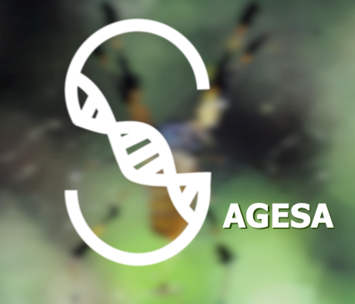

# Africa AMR Research and Training Network

Explore tools and resources for pathogen genomics and AMR

## About SAGESA

The [SAGESA project](https://sagesa.africa) established a research and training network, as an important step in building capacity for pathogen genomics and surveillance of anti-microbial resistance (AMR) in Africa. The SAGESA project is funded by the [Cambridge Africa ALBORADA Research Fund](https://www.cambridge-africa.cam.ac.uk/initiatives/the-alborada-research-fund/), and is a collaboration by scientists from the [National Institute of Communicable Diseases](https://www.nicd.ac.za) in South Africa, the Faculty of Medicine and Health Sciences, [University of Zimbabwe](http://www.uz.ac.zw/index.php/university-departments), [Wellcome Connecting Science](https://coursesandconferences.wellcomeconnectingscience.org)and the [Centre for Genomic Pathogen Surveillance](https://www.pathogensurveillance.net).    

[A Research and Training Network - Nurturing valuable sub-regional collaborations](SAGESA: a training and research network to develop capacity for genomic surveillance of AMR)

## SAGESA AMR Genomics Training Activities
SAGESA Training activities consisted of 2-hour webinar sessions and a 3 day bioinformatics workshop. To find out more about the curriculum and activities activities click on the links below  

[AMR Genomics Training Curriculum](https://github.com/WCSCourses/SAGESA/blob/main/SAGESA%20Network%20Curriculum%20and%20Activities.pdf)   

[AMR Genomics Webinar Resources](webinars.md)

[AMR Bioinformatics Workshop](https://wcscourses.github.io/AMR-Bio-Africa-2022/)
