## Evaluating Tools for AMR Detection and the Role of AI in Data Analysis

### Learning outcomes

At the end of the session, participants should be able to: - Use Pathogenwatch and ResFinder to analyze AMR genes. - Compare AMR predictions from different tools. - Apply AI tools such as ChatGPT and claude.ai to facilitate data analysis and interpretation.

### Prerequisites

Please use one of the following web browsers: Google Chrome or Mozilla Firefox.

Create an account with <https://pathogen.watch/>, an account with <https://chatgpt.com/> and one with <https://claude.ai/new>

### Training materials used in this workshop

-   [FASTA files](https://github.com/WCSCourses/SAGESA-AMR-Genomics-Network/tree/main/docs/fasta)

-   [AMR prediction tables](https://github.com/WCSCourses/SAGESA-AMR-Genomics-Network/tree/main/docs/results%20files)

### Hands-on exercises and discussion

+--------------------------------------------------------------------------------------------------------------------------------------------------------------------------------------------------------------------------------------------------------------------------------------------------------------------------------------------------------------------------------------------------------------------------+-------------------------------------------------------+
| 1.  AMR gene identification using Pathogenwatch                                                                                                                                                                                                                                                                                                                                                                          |                                                       |
+==========================================================================================================================================================================================================================================================================================================================================================================================================================+=======================================================+
| Navigate to the following Pathogenwatch collection <https://pathogen.watch/collection/njne391gukeu-s-aureus-assessment>                                                                                                                                                                                                                                                                                                  |                                                       |
+--------------------------------------------------------------------------------------------------------------------------------------------------------------------------------------------------------------------------------------------------------------------------------------------------------------------------------------------------------------------------------------------------------------------------+-------------------------------------------------------+
| Explore the Genes and the Variants tab in Pathogenwatch                                                                                                                                                                                                                                                                                                                                                                  | 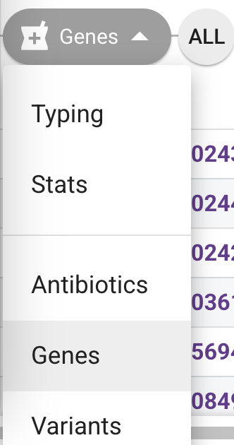{width="96"}                  |
|                                                                                                                                                                                                                                                                                                                                                                                                                          |                                                       |
|                                                                                                                                                                                                                                                                                                                                                                                                                          | 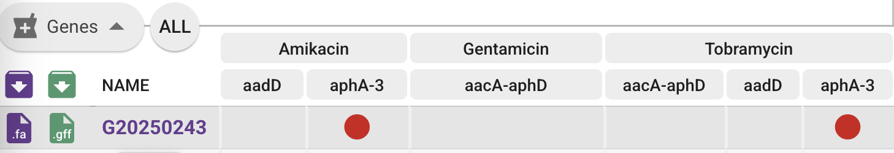                             |
+--------------------------------------------------------------------------------------------------------------------------------------------------------------------------------------------------------------------------------------------------------------------------------------------------------------------------------------------------------------------------------------------------------------------------+-------------------------------------------------------+
| Download the AMR SNPs and AMR genes tables.                                                                                                                                                                                                                                                                                                                                                                              | 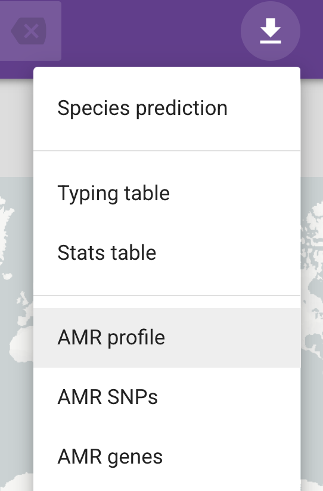{width="141"}           |
+--------------------------------------------------------------------------------------------------------------------------------------------------------------------------------------------------------------------------------------------------------------------------------------------------------------------------------------------------------------------------------------------------------------------------+-------------------------------------------------------+
| Check the information found in AMR SNPs and AMR genes tables using a table visualisation program such as Excel or Google spreadsheets.                                                                                                                                                                                                                                                                                   |                                                       |
+--------------------------------------------------------------------------------------------------------------------------------------------------------------------------------------------------------------------------------------------------------------------------------------------------------------------------------------------------------------------------------------------------------------------------+-------------------------------------------------------+
| Attempt to download a genome in .fasta format from Pathogenwatch.                                                                                                                                                                                                                                                                                                                                                        | {width="500"}            |
|                                                                                                                                                                                                                                                                                                                                                                                                                          |                                                       |
| In the search bar at the top, type "G18255058"                                                                                                                                                                                                                                                                                                                                                                           |                                                       |
+--------------------------------------------------------------------------------------------------------------------------------------------------------------------------------------------------------------------------------------------------------------------------------------------------------------------------------------------------------------------------------------------------------------------------+-------------------------------------------------------+
| Download the assembled genomes in fasta format by pressing the .fa icon.                                                                                                                                                                                                                                                                                                                                                 | 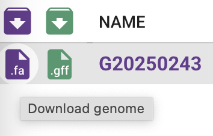{width="118"}       |
+--------------------------------------------------------------------------------------------------------------------------------------------------------------------------------------------------------------------------------------------------------------------------------------------------------------------------------------------------------------------------------------------------------------------------+-------------------------------------------------------+
| 2.  **AMR gene identification using Resfinder**                                                                                                                                                                                                                                                                                                                                                                          |                                                       |
+--------------------------------------------------------------------------------------------------------------------------------------------------------------------------------------------------------------------------------------------------------------------------------------------------------------------------------------------------------------------------------------------------------------------------+-------------------------------------------------------+
| Navigate to <http://genepi.food.dtu.dk/resfinder>                                                                                                                                                                                                                                                                                                                                                                        |                                                       |
+--------------------------------------------------------------------------------------------------------------------------------------------------------------------------------------------------------------------------------------------------------------------------------------------------------------------------------------------------------------------------------------------------------------------------+-------------------------------------------------------+
| In the Select species box, select "Staphylococcus aureus"                                                                                                                                                                                                                                                                                                                                                                | 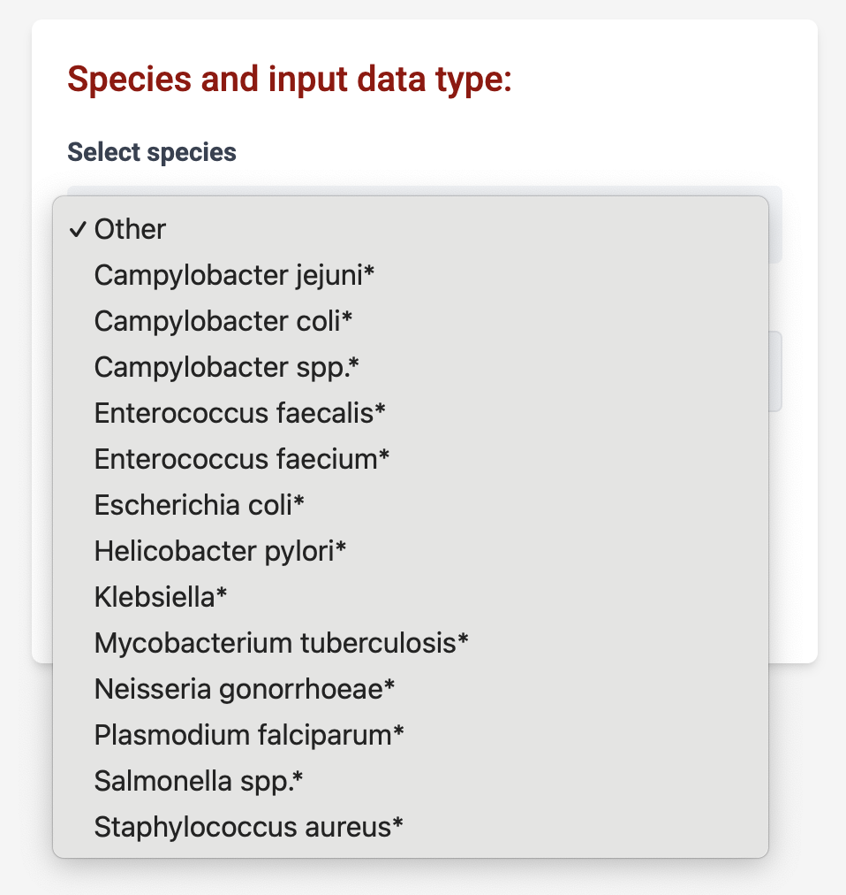{width="500"} |
+--------------------------------------------------------------------------------------------------------------------------------------------------------------------------------------------------------------------------------------------------------------------------------------------------------------------------------------------------------------------------------------------------------------------------+-------------------------------------------------------+
| Select input type as "FASTA".                                                                                                                                                                                                                                                                                                                                                                                            | 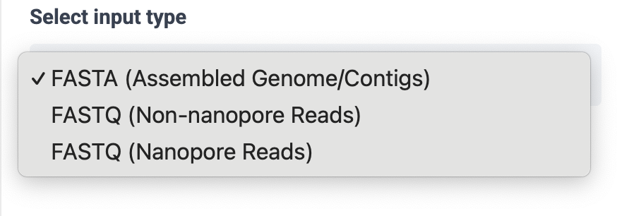{width="500"}   |
+--------------------------------------------------------------------------------------------------------------------------------------------------------------------------------------------------------------------------------------------------------------------------------------------------------------------------------------------------------------------------------------------------------------------------+-------------------------------------------------------+
| Upload the .fasta file you've downloaded from Pathogenwatch, or one of the fasta files in [this](https://github.com/WCSCourses/SAGESA-AMR-Genomics-Network/tree/main/docs/fasta) folder. Press "Submit Job".                                                                                                                                                                                                             | 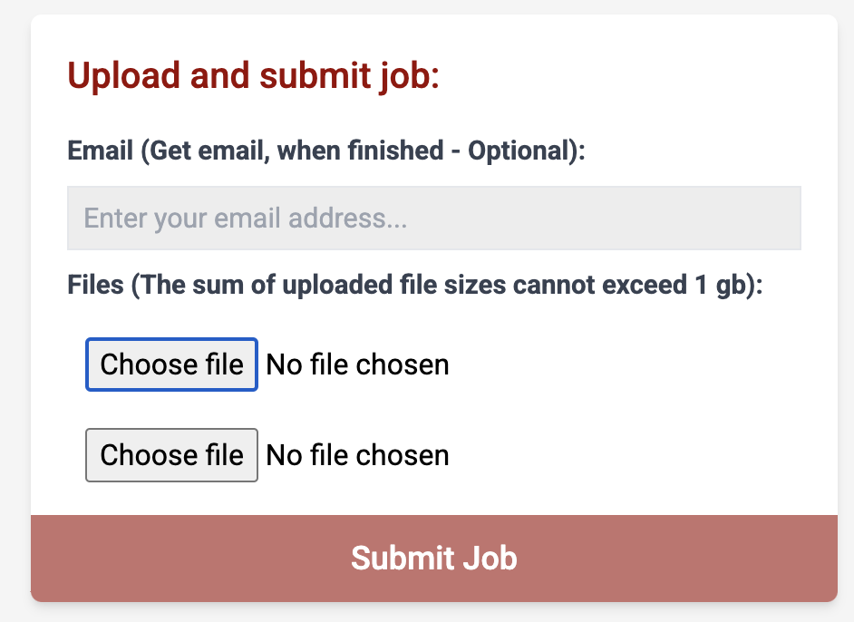                  |
+--------------------------------------------------------------------------------------------------------------------------------------------------------------------------------------------------------------------------------------------------------------------------------------------------------------------------------------------------------------------------------------------------------------------------+-------------------------------------------------------+
| When the results are loaded, download the “Results as tabseparated file”, from the “AMR gene results”.                                                                                                                                                                                                                                                                                                                   | 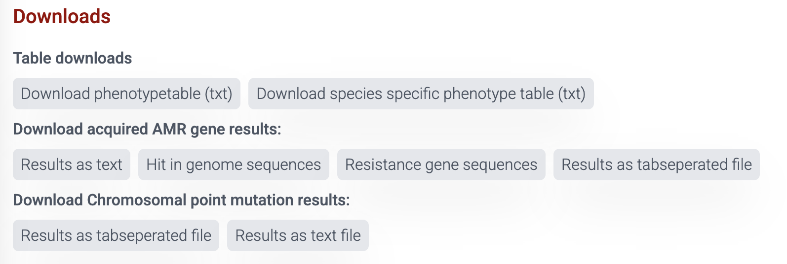{width="500"}       |
|                                                                                                                                                                                                                                                                                                                                                                                                                          |                                                       |
| Open this file and check the output format.                                                                                                                                                                                                                                                                                                                                                                              |                                                       |
|                                                                                                                                                                                                                                                                                                                                                                                                                          |                                                       |
| In case Resfinder did not produce a result for you, you can visualise an example output, for one sample, [here](https://github.com/WCSCourses/SAGESA-AMR-Genomics-Network/blob/main/docs/results%20files/Resfinder%20one%20sample%20example.txt).                                                                                                                                                                        |                                                       |
+--------------------------------------------------------------------------------------------------------------------------------------------------------------------------------------------------------------------------------------------------------------------------------------------------------------------------------------------------------------------------------------------------------------------------+-------------------------------------------------------+
| 3.  **Comparing Pathogenwatch and Resfinder AMR genes identification for 6 samples.**                                                                                                                                                                                                                                                                                                                                    |                                                       |
+--------------------------------------------------------------------------------------------------------------------------------------------------------------------------------------------------------------------------------------------------------------------------------------------------------------------------------------------------------------------------------------------------------------------------+-------------------------------------------------------+
| Previously, we ran Pathogenwatch and Resfinder for 6 Staphylococcus aureus whole genome sequences stored on [Github](https://github.com/WCSCourses/SAGESA-AMR-Genomics-Network/tree/main/docs/fasta).                                                                                                                                                                                                                    |                                                       |
|                                                                                                                                                                                                                                                                                                                                                                                                                          |                                                       |
| The aggregated results for the 6 samples have been stored on Github.                                                                                                                                                                                                                                                                                                                                                     |                                                       |
|                                                                                                                                                                                                                                                                                                                                                                                                                          |                                                       |
| Check the results produced by [Pathogenwatch](https://github.com/WCSCourses/SAGESA-AMR-Genomics-Network/blob/main/docs/results%20files/PW.csv) and the results produced by [Resfinder](https://github.com/WCSCourses/SAGESA-AMR-Genomics-Network/blob/main/docs/results%20files/Resfinder.csv).                                                                                                                          |                                                       |
|                                                                                                                                                                                                                                                                                                                                                                                                                          |                                                       |
| Do you see any difference?                                                                                                                                                                                                                                                                                                                                                                                               |                                                       |
+--------------------------------------------------------------------------------------------------------------------------------------------------------------------------------------------------------------------------------------------------------------------------------------------------------------------------------------------------------------------------------------------------------------------------+-------------------------------------------------------+
| (Optional) Here is a Python script to help you compare the results from Pathogenwatch and Resfinder.                                                                                                                                                                                                                                                                                                                     |                                                       |
|                                                                                                                                                                                                                                                                                                                                                                                                                          |                                                       |
| <https://colab.research.google.com/github/monicaiabrudan/bacterial-genomics/blob/main/Compare_AMR_files.ipynb>                                                                                                                                                                                                                                                                                                           |                                                       |
+--------------------------------------------------------------------------------------------------------------------------------------------------------------------------------------------------------------------------------------------------------------------------------------------------------------------------------------------------------------------------------------------------------------------------+-------------------------------------------------------+
| Go to <https://chatgpt.com/>                                                                                                                                                                                                                                                                                                                                                                                             | {width="500"}          |
+--------------------------------------------------------------------------------------------------------------------------------------------------------------------------------------------------------------------------------------------------------------------------------------------------------------------------------------------------------------------------------------------------------------------------+-------------------------------------------------------+
| Upload the results produced by [Pathogenwatch](https://github.com/WCSCourses/SAGESA-AMR-Genomics-Network/blob/main/docs/results%20files/PW.csv) and the results produced by [Resfinder](https://github.com/WCSCourses/SAGESA-AMR-Genomics-Network/blob/main/docs/results%20files/Resfinder.csv) and input the following prompt “Compare the PW and the Resfinder results. Which genes were identified by both methods?”. | {width="100"}          |
|                                                                                                                                                                                                                                                                                                                                                                                                                          |                                                       |
|                                                                                                                                                                                                                                                                                                                                                                                                                          | 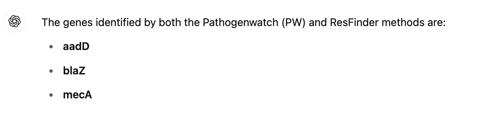{width="300"}  |
+--------------------------------------------------------------------------------------------------------------------------------------------------------------------------------------------------------------------------------------------------------------------------------------------------------------------------------------------------------------------------------------------------------------------------+-------------------------------------------------------+
| This is an example of a ChatGPT answer. You might have got a different answer, depending on the model you've used!                                                                                                                                                                                                                                                                                                       |                |
|                                                                                                                                                                                                                                                                                                                                                                                                                          |                                                       |
| How to you interpret the answers?                                                                                                                                                                                                                                                                                                                                                                                        |                                                       |
|                                                                                                                                                                                                                                                                                                                                                                                                                          |                                                       |
| Compare ChatGPT’s AMR gene identification with manual method. Are the results identical? Where do they differ?                                                                                                                                                                                                                                                                                                           |                                                       |
|                                                                                                                                                                                                                                                                                                                                                                                                                          |                                                       |
| Look at the genes “ermC” and “erm(C)”.                                                                                                                                                                                                                                                                                                                                                                                   |                                                       |
|                                                                                                                                                                                                                                                                                                                                                                                                                          |                                                       |
| Was ChatGPT able to realise these were one and the same?                                                                                                                                                                                                                                                                                                                                                                 |                                                       |
+--------------------------------------------------------------------------------------------------------------------------------------------------------------------------------------------------------------------------------------------------------------------------------------------------------------------------------------------------------------------------------------------------------------------------+-------------------------------------------------------+
| (Optional) If you have the option, try running the tasks above using a different model of ChatGPT.                                                                                                                                                                                                                                                                                                                       | 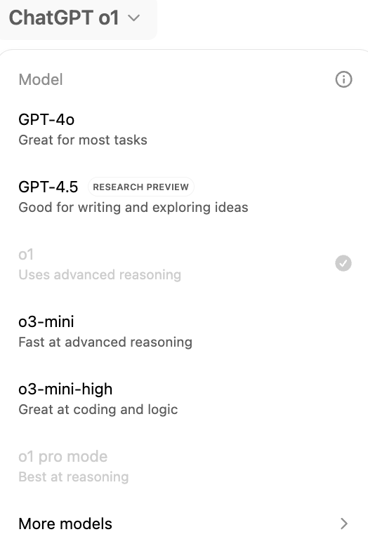{width="200"}           |
+--------------------------------------------------------------------------------------------------------------------------------------------------------------------------------------------------------------------------------------------------------------------------------------------------------------------------------------------------------------------------------------------------------------------------+-------------------------------------------------------+
| Go to <https://claude.ai/new>                                                                                                                                                                                                                                                                                                                                                                                            |                                                       |
+--------------------------------------------------------------------------------------------------------------------------------------------------------------------------------------------------------------------------------------------------------------------------------------------------------------------------------------------------------------------------------------------------------------------------+-------------------------------------------------------+
| Upload the files.                                                                                                                                                                                                                                                                                                                                                                                                        | {width="200"}            |
+--------------------------------------------------------------------------------------------------------------------------------------------------------------------------------------------------------------------------------------------------------------------------------------------------------------------------------------------------------------------------------------------------------------------------+-------------------------------------------------------+
| Type the following prompt: Compare the PW and the Resfinder results. Which genes were identified by both methods?"                                                                                                                                                                                                                                                                                                       | 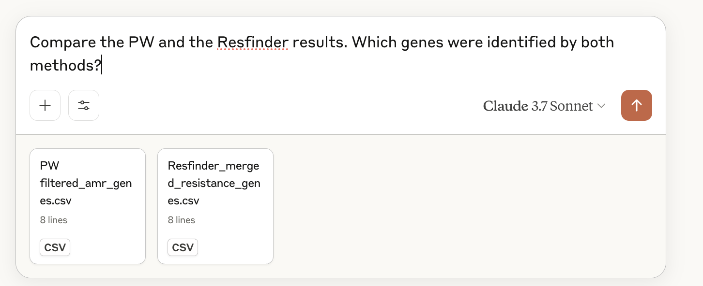{width="300"}            |
+--------------------------------------------------------------------------------------------------------------------------------------------------------------------------------------------------------------------------------------------------------------------------------------------------------------------------------------------------------------------------------------------------------------------------+-------------------------------------------------------+
| An example of a result from Claude.ai                                                                                                                                                                                                                                                                                                                                                                                    | 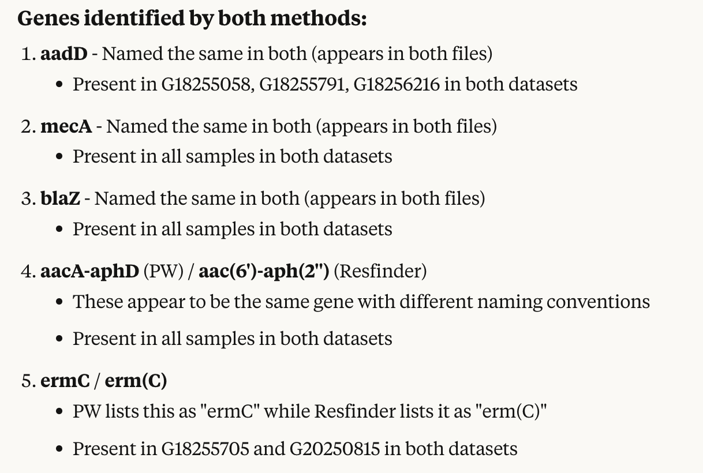                        |
|                                                                                                                                                                                                                                                                                                                                                                                                                          |                                                       |
| How to you interpret the answers?                                                                                                                                                                                                                                                                                                                                                                                        |                                                       |
|                                                                                                                                                                                                                                                                                                                                                                                                                          |                                                       |
| Compare Claude.ai AMR gene identification with manual method. Are the results identical? Where do they differ?                                                                                                                                                                                                                                                                                                           |                                                       |
|                                                                                                                                                                                                                                                                                                                                                                                                                          |                                                       |
| Look at the genes “ermC” and “erm(C)”.                                                                                                                                                                                                                                                                                                                                                                                   |                                                       |
|                                                                                                                                                                                                                                                                                                                                                                                                                          |                                                       |
| Was Claude.ai able to realise these were one and the same?                                                                                                                                                                                                                                                                                                                                                               |                                                       |
+--------------------------------------------------------------------------------------------------------------------------------------------------------------------------------------------------------------------------------------------------------------------------------------------------------------------------------------------------------------------------------------------------------------------------+-------------------------------------------------------+
| **Important note:**                                                                                                                                                                                                                                                                                                                                                                                                      |                                                       |
|                                                                                                                                                                                                                                                                                                                                                                                                                          |                                                       |
| **Importance of Validation**: Always cross-check LLM outputs against known databases (e.g., **CARD**, **ResFinder**, **ARG-ANNOT**) or relevant literature to ensure the accuracy of gene–drug resistance links.                                                                                                                                                                                                         |                                                       |
+--------------------------------------------------------------------------------------------------------------------------------------------------------------------------------------------------------------------------------------------------------------------------------------------------------------------------------------------------------------------------------------------------------------------------+-------------------------------------------------------+
